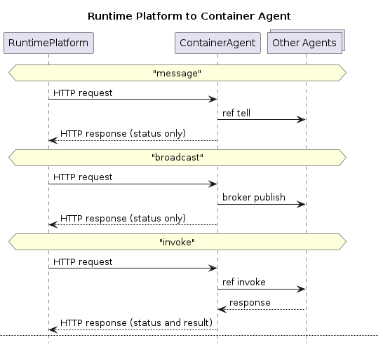
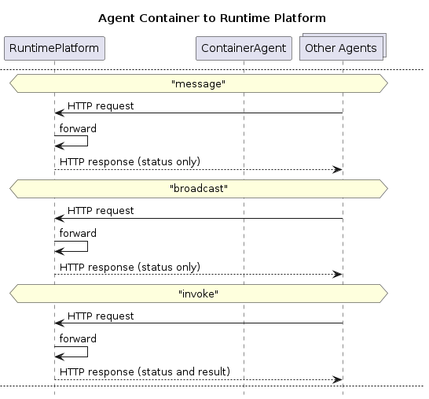
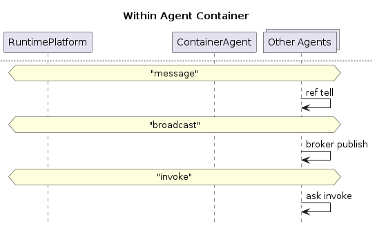
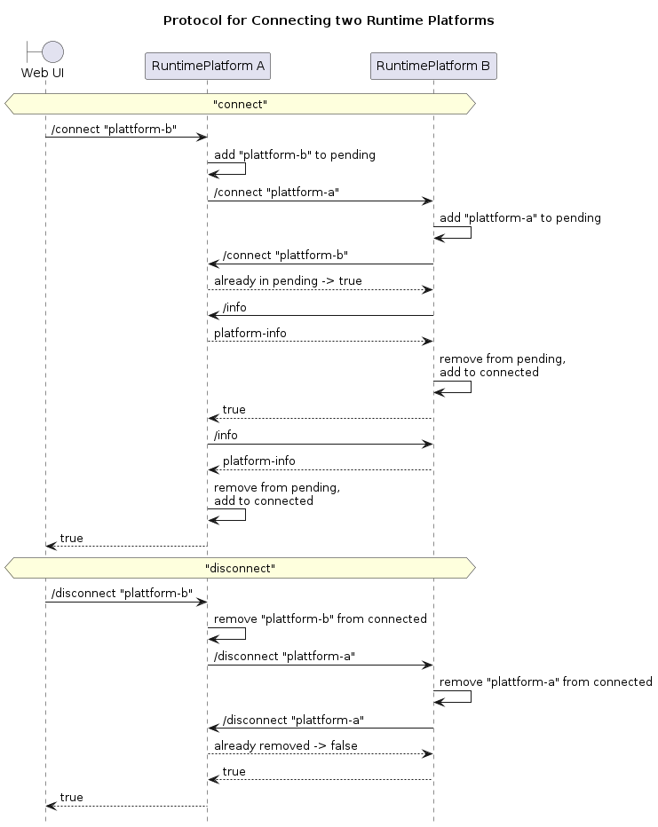
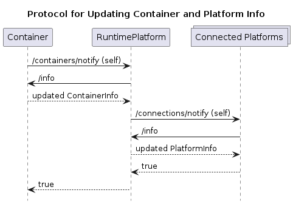

# Prototype for JIAC++ API and Reference Implementation

This module provides a first simple prototype/proof-of-concept for the "JIAC++" API,
as well as a reference implementation in Java and an example container.

This is in no way meant to be final, but rather to provide a basis for further discussions
and first tests in order to find out what of this makes sense etc.

## Modules

* `jiacpp-platform`: reference implementation of Runtime Platform, done in Java + Spring Boot
* `jiacpp-container`: reference implementation of Agent Container, done in JIAC VI (Java, Kotlin)
* `jiacpp-model` interface descriptions and model classes for the API (Java)
* `examples`: sample agent container(s) to be executed on the platform; to be defined, preferably one using the JIAC VI reference implementation and another, simpler one using plain Python (e.g. FastAPI, possibly just a subset of the API)

## Getting Started / Quick Testing Guide

* run `mvn install` in the parent directory to build everything in order
* build the sample container with `docker build -t sample-agent-container-image jiacpp-container`
* start the platform with `java -jar jiacpp-platform/target/jiacpp-platform-0.1-SNAPSHOT.jar`
* go to <http://localhost:8000/swagger-ui/index.html>
* go to `POST containers`, click "try it out", and set the `imageName` to `"sample-agent-container-image"`, or copy the entire content from `jiacpp-container/container.json` (but the other attributes don't actually matter for now)
* in another terminal, do `docker ps` to find the started image, and then `docker logs -f <container-name>` to show (and follow) the logs
* in the Web UI, run the `GET containers` or `GET agents` routes to see the running agents and their actions
* use the `POST send` or `POST invoke` routes to send messages to the agent (with any payload; reply-to does not matter for now), or invoke the agent's dummy action (the action takes some time to run); check the logs of the agent container; you can also invoke the action and then immediately re-send the message to check that both work concurrently
* shut down the platform with Ctrl+C; the agent container(s) should shut down as well

## Message Flows in Reference Implementation

### Runtime Platform to Agent Container

* **message**: HTTP request to CA (in HTTP handler thread), send message via `agent_ref tell`
* **broadcast**: HTTP request to CA (in HTTP handler thread), send message via `broker.publish`
* **invoke**: HTTP request to CA (in HTTP handler thread), send `Invoke` to agent via `ask invoke` protocol, wait for response (in CA thread), reply in HTTP response

### Agent Container to Runtime Platform

* **message**: agent sends HTTP request to RP via helper method in super class
* **broadcast**: agent sends HTTP request to RP via helper method in super class
* **invoke**: agent sends HTTP request to RP via helper method in super class, waits for response in its own thread

### Within Agent Container

* **message**: using regular JIAC-VI `agent_ref tell`
* **broadcast**: using regular JIAC-VI `broker publish`
* **invoke**: using regular JIAC-VI `ask invoke`, either with JIAC++ `Invoke` object or any other payload

### Runtime Platform to Runtime Platform 

* not yet implemented, but basically, the same flow for all communication
* look up other connected RP that has the target container
* forward **message** or **invoke** to that platform
* unclear: **broadcast**: how to prevent endlessly forwarding message back and forth? keep track of recently seen messages? or keep sender-history in each forwarded message and don't forward messages to RP in that history?

### Protocol for connecting two Runtime Platforms

* platform A receives request to connect to platform B
* sends request to connect to platform A (itself) to platform B, adds B to "pending"
* platform B does the same, sending another request back to A and adding A to "pending"
* platform A recognizes the new request as already being processed and replies immediately
* platform B replies to original request, both platforms call "info" on each other

### Protocol for notifying about updated Containers or connected Platforms

* container/platform calls `/containers/notify` or `/connections/notify` with own ID/URL respectively
* the idea behind "notify, then pull info" instead of "push info" is to make sure that the info does actually come from the container/platform in question and not someone else
* receiving platform calls `/info` for that container/platform, stores updated information
* return `true` if update successful, `false` if not reachable (see below) and 404 if unknown/not in list
* if container/platform are not reachable, their information is removed from the platform
* can be called if container's agents/actions change, if container is about to die, or at any time by the user
* update in containers (via add/remove or update) automatically triggers notification of connected platforms

