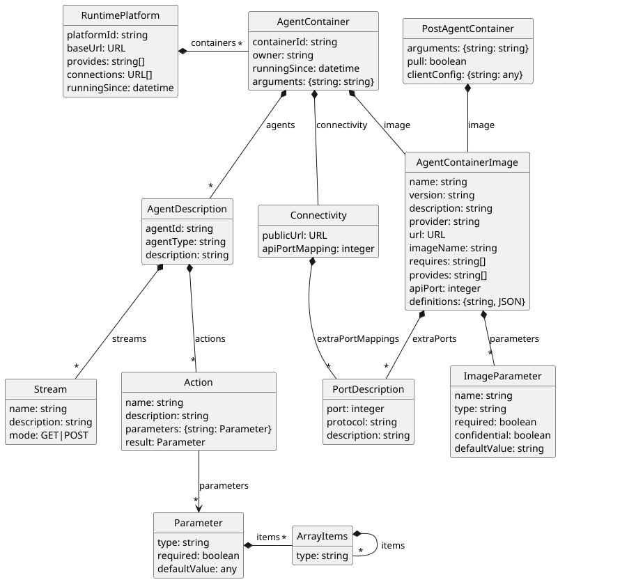

# API Routes and Models

This document shows a high-level, easy-to-read, language-agnostic overview of the OPACA API, the different routes, etc. It _should_ be kept up to date, but might not always _be_ up-to-date. When in doubt, please consult the Interfaces and Model classes in the `opaca-model` module, or just start a Runtime Platform and check the documentation in the Swagger Web UI.

Note that besides the REST routes described in this file, the OPACA Runtime Platform also provides a `/subscribe` endpoint to which one can subscribe via a [websocket](websockets.md) to get notifications about different events.


## Environment Variables (Agent Container)

When an Agent Container is started by the Runtime Platform, a number of environment variables are set to facilitate the communication between the Agent Container and its parent Runtime Platform.

* `CONTAINER_ID` The Agent Container's own container ID used to identify the container at the Runtime Platform.
* `PLATFORM_URL` The URL or IP address where the Agent Container can reach its parent Runtime Platform
* `TOKEN` Bearer token assigned to the container needed to interact with the parent Runtime Platform if it is using authentication (see [Authentication](auth.md) for details).
* `OWNER` The username corresponding to the user who has started the Agent Container. The owner has special permissions to perform actions on his own containers.
* `PORT_MAPPING` Which ports on the host the container's ports are mapped to, in the format `containerPort1:hostPort1,...`


## Agents API

* provided by the Agent Container, and by the Runtime Platform (the latter just forwarding to the former)

### `GET /info`

* get information about this agent container
* input: none
* output: `AgentContainer`
* errors: none

### `GET /agents?includeConnected={true|false}`

* get all agents running in the agent container, or in all agent containers of the platform (or connected platforms)
* input: none
  * includeConnected: (optional, default `false`) `true/false`, whether to include agents of connected platforms (only for Runtime Platform!)
* output: `[ AgentDescription ]`
* errors: none

### `GET /agents/{agent}`

* get description of a specific agent
* input: 
    * agent: ID of the agent to get
* output: `AgentDescription`
* errors: 200 / null result for unknown agent

### `POST /send/{agent}?containerId={containerId}&forward={true|false}`

* send asynchronous message to agent
* input: 
    * agent: ID of the agent to send the message to
    * containerId: (optional) if the request should only go to one specific container
    * forward: (optional, default `true`) `true/false`, whether the message should be forwarded to connected platforms in case the agent does not exist on this platform
* body: `Message`
* output: none
* errors: 404 for unknown agent

### `POST /broadcast/{channel}?containerId={containerId}&forward={true|false}`

* send asynchronous message to all agents subscribed to the channel
* input: 
    * channel: name of the message channel
    * containerId: (optional) if the request should only go to one specific container
    * forward: (optional, default `true`) `true/false`, whether the request should be forwarded to connected platforms in case the channel does not exist on this platform
* body: `Message`
* output: none
* errors: none

### `POST /invoke/{action}/{agent}?timeout={int}&containerId={containerId}&forward={true|false}`

* invoke action/service provided by the given agent and get result (synchronously) 
* expected parameter and output types are given in the action description
* input: 
    * action: name of the action
    * agent: ID of the agent to invoke the action on
    * timeout: (optional, default `-1`) timeout after which to stop the action; `-1` means the default-timeout used by the container, which might be no timeout, or some fixed time (e.g. 30 seconds in JIAC VI)
    * containerId: (optional) if the request should only go to one specific container 
    * forward: (optional, default `true`) `true/false`, whether the request should be forwarded to connected platforms in case the action/agent does not exist on this platform
* body: JSON object mapping parameter names to parameters
* output: result of the action
* errors: 404 for unknown action or agent, 400 for mismatched arguments

### `POST /invoke/{action}?timeout={int}&containerId={containerId}&forward={true|false}`

* same as `POST /invoke/{action}/{agent}`, but invoke action at _any_ agent that provides it

### `GET /stream/{stream}/{agent}?containerId={containerId}&forward={true|false}`

* get stream provided by the given agent
* input:
  * stream: name of the stream
  * agent: ID of the agent to invoke the action on
  * containerId: (optional) if the request should only go to one specific container
  * forward: (optional, default `true`) `true/false`, whether the request should be forwarded to connected platforms in case the action/agent does not exist on this platform
* output: the stream
* errors: 404 for unknown stream or agent

### `GET /stream/{stream}?containerId={containerId}&forward={true|false}`

* same as `GET /stream/{stream}/{agent}`, but get stream at _any_ agent that provides it

### `POST /stream/{stream}/{agent}?containerId={containerId}&forward={true|false}`

* post/send stream to the given agent
* input:
  * stream: name of the stream
  * agent: ID of the agent to invoke the action on
  * containerId: (optional) if the request should only go to one specific container
  * forward: (optional, default `true`) `true/false`, whether the request should be forwarded to connected platforms in case the action/agent does not exist on this platform
* body: the stream
* output: none
* errors: 404 for unknown stream or agent

### `POST /stream/{stream}?containerId={containerId}&forward={true|false}`

* same as `POST /stream/{stream}/{agent}`, but get stream at _any_ agent that understands it


## Platform API

* provided by the Runtime Platform, in addition to the above routes (which are just forwarded to the Agent Container)
* a part of those routes may also be provided by an "Agent Bundle" as an in-between of Agent Container and Runtime Platform, still t.b.d.


### `GET /info`

* get information about this runtime platform
* input: none
* output: `RuntimePlatform`
* errors: none

### `GET /config`

* get information on the configuration of this runtime platform
* input: none
* output: `{'key': value}`, can vary depending on implementation
* errors: none

### `GET /history`

* get history on this Runtime Platform, i.e. what routes have been called (except simple GET requests)
* input : none
* output: `[ Event ]`
* errors: none

### `GET /containers`

* get list of agent containers currently running on this platform
* input: none
* output: `[ AgentContainer ]`
* errors: none

### `GET /containers/{container}`

* get information on a specific agent container
* input: 
    * container: ID of the agent container
* output: `AgentContainer`
* errors: 200 / null for unknown container

### `POST /containers`

* deploy new Agent Container onto this platform; the body specifies the image to be deployed (not all fields have to be present, e.g. no "description", but image-name, ports, and parameters, if any) and any arguments (i.e. values for the parameters), passed as environment variables and optional a configuration for the container environment in use (e.g. which Kubernetes node to use).
* body: `PostAgentContainer`
* output: ID of the created AgentContainer (string)
* errors: 404 if image not found, 502 (bad gateway) if container did not start properly

### `PUT /containers`

* similar to "POST", but replaces an existing container belonging to the same image (identified by image-name); only works if there is _exactly_ one matching running container, otherwise fails
* body: `PostAgentContainer`
* output: ID of the created AgentContainer (string)
* errors: 404 if image not found, 502 (bad gateway) if container did not start properly, 400 if zero or more than one matching containers found

### `POST /containers/notify`

* notify the platform about changes in one of its containers
* body: `containerId` of the container
* output: `true/false`, depending on whether the container responded to `/info` call; if it does not respond, container is removed
* errors: 404 if container does not exist on platform

### `DELETE /containers/{container}`

* stop/delete/undeploy AgentContainer with given ID from the platform
* input: 
    * container: ID of the agent container to remove
* output: `true/false` whether the container could be removed or not (not found)
* errors: none

### `GET /connections`

* get list of other Runtime Platforms this platform is connected to (just the base URL, not full info)
* input: none
* output: `[ url ]`
* errors: none

### `POST /connections`

* connect platform to another remote Runtime Platform (both directions, unless remote requires authentication, then just one direction)
* input: username & password (optional, if remote RP requires authentication)
* body: the base URL of that other Runtime Platform
* output: `true/false` whether the platform was newly connected or already known
* errors: 502 (bad gateway) if not reachable

### `POST /connections/notify`

* notify the platform about changes in a connected Runtime Platform
* body: the base URL of the other Runtime Platform
* output: `true/false`, depending on whether the other platform responded to `/info` call; if it does not respond, connection is removed
* errors: 404 if the other platform is not connected to this platform

### `DELETE /connections`

* disconnect from another Runtime Platform (both directions)
* body: the base URL of the other Runtime Platform
* output: `true/false` whether it was disconnected
* errors: 502 if not reachable (only if it was connected before)


## Authentication

### `POST /login`

* login with user credentials
* input:
    * username
    * password
* output: Token
* errors: 403 if user is not registered


### Common Themes of different Routes

* the `/send`, `/broadcast` and `/invoke` routes of the Agents API each have two optional query-parameters: `containerId` telling which specific container to address (default: any), and `forward` telling whether the call can be forwarded to another platform, if the agent or action is not found in a container on this one (default: true); these parameters are only relevant for the Runtime Platform version of those routes and can be ignored for the Agent Containers themselves
* typically, the API will return HTTP Status codes 502 if the call could not be forwarded to the target container or platform, and 404 if the agent or action is question has not been found (an exception being the `DELETE` routes, since here the effect is the same whether the container/platform was found; those will just return `false` in this case)


## Models

### RuntimePlatform
```
{
    "baseUrl": URL,
    "containers": [ AgentContainer ],
    "provides": [ string ],
    "connections": [ URL ]
}
```

### AgentContainer

```
{
    "containerId": string,
    "image": AgentContainerImage,
    "arguments": {string: string}
    "agents": [ AgentDescription ],
    "owner": string,
    "runningSince": "yyyy-MM-dd'T'HH:mm:ss.SSS'Z'"
    "connectivity": {
        "publicUrl": URL,
        "apiPortMapping": int,
        "extraPortMappings": {
            int: {
                "protocol": string,
                "description": string
            }
        }
    }
}
```

### AgentContainerImage
```
{
    "imageName": string,
    "requires": [ string ],
    "provides": [ string ],
    "name": string,
    "description": string,
    "provider": string
    "apiPort": int, // default: 8082
    "parameters": [
        {"name": string, "type": string, "required": boolean, "confidential": boolean, "defaultValue": string}
    ],
    "extraPorts": {
        int: {
            "protocol": string,
            "description": string
        }
    }
}
```

### AgentDescription

```
{
    "agentId": string,
    "agentType": string,
    "actions": [ Action ]
}
```

### Action
```
{
    "name": string,
    "parameters": {string: Parameter},
    "result": Parameter
}
```
Note: The `parameters` key is a map of the argument names to their expected types. Similarly, `result` denotes the action's return type. Please refer to [Validation](validation.md) for the format and how parameter validation works.

### Message
```
{
    "payload": any,
    "replyTo": string
}
```

The relations between the model classes used in the different API routes are depicted in the following figure:



Note that this is not a 100% accurate reproduction of the classes in `opaca-model`, e.g. the `port` is actually not an attribute of the PortDescription but a key in a hash map.
