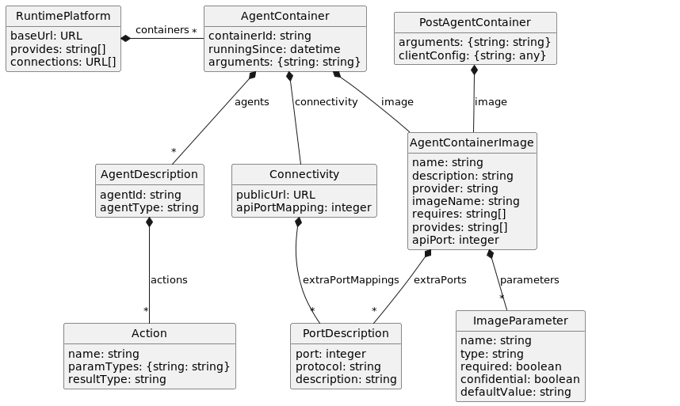

# API Routes and Models

We will _not_ reiterate the different API routes here, as that would just be bound to become outdated and 
inconsistent with the actual API rather sooner than later. Instead, please refer to the (mostly up to date)
[Wiki](https://gitlab.dai-labor.de/groups/jiacpp/-/wikis/API) or, even better, consult the different Interfaces
and Model files in the `jiacpp-model` module.

<!-- or move the API description from the Wiki to this file? might make more sense -->

## Models

The model classes used in the different API routes are depicted in the following figure:

Note that this is not a 100% accurate reproduction of the classes in `jiacpp-model`, e.g. the `port` is actually not an attribute of the PortDescription but a key in a hash map.
