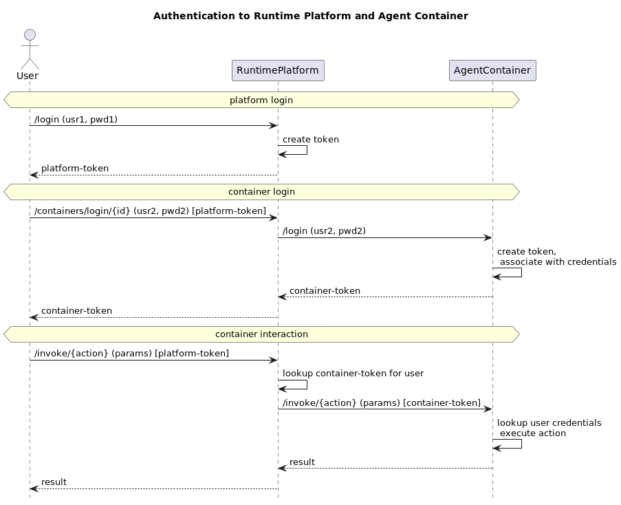

# Authentication

## Platform Authentication

The Runtime Platform can optionally require Authentication on all routes, as determined by the `REQUIRE_AUTH` environment variable. Authentication is handled through a JWT (JSON Web Token) bearer token, which is issued by the Runtime Platform to all authorized users as well as to all Agent Containers started by the platform.

Using the Swagger UI, you have to click the "Authorize" button and enter the token, which will subsequently be used for all requests. When calling the routes programmatically, including e.g. from within the Agent Container, the token has to be provided as a header field, e.g. `connection.setRequestProperty("Authorization", "Bearer " + token)`.

### Requiring Platform Authentication

By default, authentication is not required. To change that, set the `REQUIRE_AUTH` environment variable to `true`. Also, you will have to specify a "secret" and admin-password. All of those are set via Environment Variables, either in the Docker Compose or using `export` (or equivalent) before starting the container, e.g.:

```bash
export REQUIRE_AUTH=true
export SECRET=...
export PLATFORM_ADMIN_PWD=...
```

**NOTE:** Even if authentication is not _required_, it is _enabled_ and can be used to create new Users, log in and invoke actions as those users. This is so that Container Login (see below) is properly usable even if no platform login is required. Otherwise, container-login tokens would be associated with the default user, which may not be desirable if the platform is used by multiple users.

Please refer to the [User Management](user-management.md) documentation on how to add additional users to the system.

### Authenticating Users against the Runtime Platform

The Runtime Platform utilizes O2Auth as its authentication mechanism, requiring users to log in using their credentials. These credentials are subsequently compared to those provided in the environmental variables, as outlined in the previous section. Upon successful validation, the user is issued a token which enables interaction with the Runtime Platform. To facilitate this interaction, the user must inject the JWT into the lock, visibly located in the upper right corner of the window when accessing the Swagger UI. Subsequently, the JWT is consistently included in the header of all requests sent by the endpoints.

### Authenticating Agent Containers against the Runtime Platform

When an AgentContainer is initiated, it is assigned its own token in the `TOKEN` environmental variable. This token serves as an authentication mechanism when communicating with the Runtime Platform and has to be provided as a header in all requests (see above). In the JIAC VI Reference Implementation, this is handled automatically by the `ContainerAgent` and `AbstractContainerizedAgent`.

### Authenticating the Runtime Platform against its Agent Containers

If authentication is enabled, the RuntimePlatform sends the AgentContainer's own token with each request to the container, so it can verify that the requests actually came from the RuntimePlatform and not from some external entity, bypassing the platform. In the JIAC VI Reference Implementation, this is handled automatically by the `ContainerAgent`.

### Authenticating the Runtime Platform against another Runtime Platform

If authentication is enabled at a remote RuntimePlatform, the `POST /connections` route requires an additional `token` parameter. This token is then associated with the platform and used in all following requests to that platform, e.g. for invoking actions there. If the `connectBack` parameter is set, the platform will generate a token to be used by the connected platform (similar to when containers are started) and include that in the request to the other platform to connect back to itself.


## Container Authentication

In addition to the Runtime Platform as a whole, individual Agent Containers can also require authentication in order to function properly. As an example, a container may interface with the user's e-mails, calendar, or some other personal account. If the container is to be used by a single user only, this information could be provided in container-parameters (see [API, section AgentContainerImage](api.md)), but this fails if the container should be used by multiple users.

Using the `/containers/login/{containerId}` route (introduced in version 0.4), users can login to individual containers, using credentials that are specific to those containers. The credentials are forwarded to the container, which then associates them with a randomly generated token and returns that to the runtime platform. This token is then included as a special HTTP header, `ContainerLoginToken` in all subsequent requests to that container by the same user, currently logged in to the OPACA Runtime Platform. (If Platform-Authentication is not enabled, the tokens are associated with the platform default admin-user instead.) To log out from the container, use the  `/containers/login/{containerId}` route while logged in as the same user.

**Note** that the actual handling of the user credentials is done by the implementing Agent Container and not part of the OPACA API. It is advised to e.g. instantiate and cache a user-specific client for the upstream service the credentials are needed for and not to store them in the container itself. Similarly, the container-credentials are received in plain-text by the runtime platform and passed on to the agent-container, but are at no point stored or logged by the platform.

If feasible, the Agent Container should test the credentials immediately when the `login` route is called. If this is not possible, the credentials (or an appropriately instantiated API client) may just be stored for later use. In case credentials have been tested but do not work, the container should return a **401** (unauthorized) status code. If container login is not supported, a **501** (not implemented) status code should be returned (this is the default behavior).


## Visualization

The following sequence diagram shows, slightly simplified, how the interaction between user, runtime platform, and agent container takes place. In the arrow labels, `{...}` denotes a path parameter, `(...)` the request body, and `[...]` an HTTP header.


