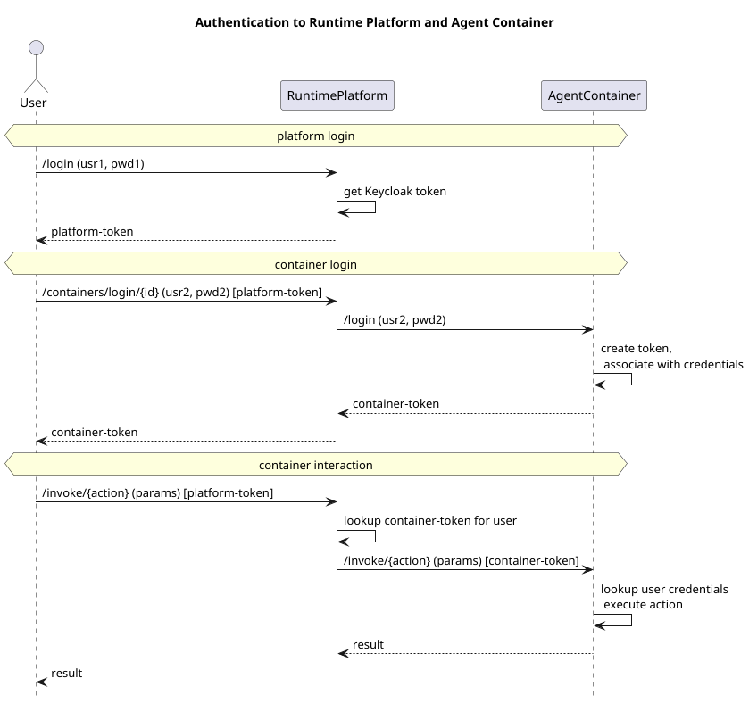

# Authentication

## Platform Authentication

The Runtime Platform can optionally require Authentication on all routes, as determined by the `REQUIRE_AUTH` environment variable. Authentication is handled through a JWT (JSON Web Token) bearer token, which is issued by a Keycloak instance to all authorized users as well as to all Agent Containers started by the platform. Please see details below on how authentication works for communication between the different parties.

Using the Swagger UI, you have to click the "Authorize" button and enter the token, which will subsequently be used for all requests. When calling the routes programmatically, including e.g. from within the Agent Container, the token has to be provided as a header field, e.g. `connection.setRequestProperty("Authorization", "Bearer " + token)`.

To get the token, you can use the `/login` route and enter your Keycloak credentials, or acquire the token directly from Keycloak. Note that when using the `/login` route, your Keycloak credentials are passed through the OPACA platform, but they will at no point be stored or logged.

By default, authentication is not required, but even if authentication is not _required_, it is _enabled_ (provided that Keycloak is configured) and can be used to log in and invoke actions as specific users. This is so that Container Login (see below) is properly usable even if no platform login is required. Otherwise, container-login tokens would be associated with the default user, which may not be desirable if the platform is used by multiple users. 

## Rule Based Access Control

When checking a users' authority, their role as well as their privileges are converted to so-called "Granted Authorities". This is primarily used by the Security Filter Chain, but is also checked during requests, which can be accessed by lower-level authorities, but need further checking for specific permissions.

These are the currently implemented Roles. The roles are part of a role hierarchy, granting the higher role all permissions of the lower role.

- **MANAGER**: Has the highest authority and full control over a Runtime Platform. Can connect the platform with other platforms.
- **CONTRIBUTOR**: Is actively contributing to the Runtime Platform by providing and deploying containers. Is able to delete only its own deployed containers.
- **USER**: Can use the functionalities provided by the running containers on the Runtime Platform. Is also able to send/broadcast messages on the platform and retrieve information about connected platforms or the history of the platform.
- **GUEST**: Is a provisional role with the most limited access. Is only able to get information about the Runtime Platform, running containers and agents.

**Note:** The roles and the above role hierarchy have to be defined in the Keycloak Realm; see below for setting up Keycloak.

The following table provides an overview of all implemented routes along with the necessary authority levels. In addition to those, the routes `/login`, `/error`, as well as specific _swagger.io_ paths are permitted to all (non-logged in) users.

| Routes and Methods          | MANAGER | CONTRIBUTOR | USER | GUEST |
|:----------------------------|:-------:|:-----------:|:----:|:-----:|
| /agents/**                  |    X    |      X      |  X   |   X   |
| /broadcast/**               |    X    |      X      |  X   |       |
| /containers/** GET          |    X    |      X      |  X   |   X   |
| /containers/** DELETE/POST  |    X    |     X*      |      |       |
| /containers/(login,logout)  |    X    |      X      |  X   |       |
| /connections GET            |    X    |      X      |  X   |       |
| /connections/** DELETE/POST |    X    |             |      |       |
| /history GET                |    X    |      X      |  X   |       |
| /info GET                   |    X    |      X      |  X   |   X   |
| /invoke/**                  |    X    |      X      |  X   |       |
| /send/**                    |    X    |      X      |  X   |       |
| /stream/**                  |    X    |      X      |  X   |       |
| /mcp                        |    X    |      X      |  X   |       |
| /subscribe                  |    X    |      X      |  X   |       |

*: A contributor can only delete containers which were started by it.

## Setup and Configuration

### Environment Variables set the Platform

Authentication is configured using a number of Environment variables All of those are set either in the Docker Compose or using `export` (or equivalent) before starting the Runtime Platform.

* `REQUIRE_AUTH`: Whether auth is required for accessing most routes.
* `KC_ISSUER_URI`: Keycloak JWT Issuer-URI up to and including the Realm to be used, i.e. in the form `<host>/realms/<realm>`; must be provided if Auth is required, and for allowing for user login, otherwise optional.
* `KC_CLIENT`: Name of the public Keycloak client within the real to be used for users.
* `KC_ADMIN`: Username of a Keycloak user with admin privileges in the realm; needed for creating temporary clients.
* `KC_ADMIN_PW`: Password for the above user with admin privileges.

### Relevant Environment Variables passed to the Container

In the container, the Keycloak Issuer URI can be found in the `KEYCLOAK_URL` variable. The platform has created a private client for the Container, which can be used for getting access tokens for communicating with the parent platform. The client's ID is the `CONTAINER_ID`; its secret as given in the `CLIENT_SECRET` environment variable. See `AuthHelper` class in the JIAC VI reference implementation for details.

See [API docs](api.md) for complete list of environment variables passed to the Agent Container when it is started.

### Keycloak Setup

You can start Keycloak using the Docker Compose file found in this repository, or by any other means, or use an existing Keycloak instance. You can then set up a Realm for OPACA:

* Create a Keycloak Realm matching the one from `KC_ISSUER_URI`, e.g. `opaca`
* Within that Realm, create a public Client matching `KC_CLIENT`, e.g. `opaca-rp`
* Within that Realm, create Roles `GUEST`, `USER`, `CONTRIBUTOR`, and `MANAGER`, with each role including the one before it.
* For logging in, create a user in the realm and assign it an appropriate Role.

You can find a script within this repository to automate the Keycloak realm setup.

## Authentication Workflows

### Authenticating Users against the Runtime Platform

For users to authenticate against the runtime platform, they first have to create a user account in Keycloak Realm given in the environment. They can then use the `/login` route of the Runtime Platform to get a JWT Access Token, or get that token directly from Keycloak. This token then has to be supplied in the `Authentication: Bearer <token>` header for all subsequent requests. Using the Swagger Web UI, this can be achieved by using the Authorize button to log in with the previously generated token, visibly located in the upper right corner of the window when accessing the Swagger UI. Subsequently, the JWT is consistently included in the header of all requests sent by the endpoints.

### Authenticating Agent Containers against the Runtime Platform

When an Agent Container is initiated, the runtime platform creates a temporary client within Keycloak for this container, using the Container-ID as the Client-ID. The client's "secret" is passed to the Container in its environment, along with the Keycloak URL. The Container can then acquire Access Tokens for that client through Keycloak and use those to authenticate itself against its parent Runtime Platform, e.g. for calling actions provided by agents in different containers. In the JIAC VI Reference Implementation, this is handled automatically by the `ContainerAgent` and `AbstractContainerizedAgent`.

### Authenticating the Runtime Platform against its Agent Containers

On startup, the platform also creates a temporary client for itself, which is then used to create access tokens for forwarding requests to the containers. <!-- NOT YET IMPLEMENTED The token includes the original requester's username as a sub-field, without exposing their original JWT to the container, so the container can not impersonate that user.--> The container should then check the validity of the token (c.f. the JIAC VI Reference Implementation for how this can be done) and can optionally also check which user made the request. (A user may also use their own JWT to send a request directly to the container, but as long as authentication is enabled, the container should reject requests with a missing or invalid JWT.)

### Authenticating the Runtime Platform against another Runtime Platform

At the moment, connecting two platforms requires both platforms to use the same Keycloak instance and Realm, so they can acquire access tokens to authenticate at each others (or not requiring auth at all).

## Container Authentication

In addition to the Runtime Platform as a whole, individual Agent Containers can also require authentication in order to function properly. As an example, a container may interface with the user's e-mails, calendar, or some other personal account. If the container is to be used by a single user only, this information could be provided in container-parameters (see [API, section AgentContainerImage](api.md)), but this fails if the container should be used by multiple users.

Using the `/containers/login/{containerId}` route (introduced in version 0.4), users can log in to individual containers, using credentials that are specific to those containers. The credentials are forwarded to the container, which then associates them with a randomly generated token and returns that to the runtime platform. This token is then included as a special HTTP header, `ContainerLoginToken` in all subsequent requests to that container by the same user, currently logged in to the OPACA Runtime Platform. (If Platform-Authentication via Keycloak is not enabled, the tokens are associated with the platform default "anonymous" user instead.) To log out from the container, use the  `/containers/login/{containerId}` route while logged in as the same user.

**Note** that the actual handling of the user credentials is done by the implementing Agent Container and not part of the OPACA API. It is advised to e.g. instantiate and cache a user-specific client for the upstream service the credentials are needed for and not to store them in the container itself. Similarly, the container-credentials are received in plain-text by the runtime platform and passed on to the agent-container, but are at no point stored or logged by the platform.

If feasible, the Agent Container should test the credentials immediately when the `login` route is called. If this is not possible, the credentials (or an appropriately instantiated API client) may just be stored for later use. In case credentials have been tested but do not work, the container should return a **401** (unauthorized) status code. If container login is not supported, a **501** (not implemented) status code should be returned (this is the default behavior).

### Container Login for Extra Ports

Agent Containers may provide "extra-ports" for e.g. custom web-UIs or for exposing additional services or protocols. These ports are called directly at the Agent Container (the ports are mapped to free ports on the host machine, but the calls are not routed through the OPACA Runtime Platform). Thus, the RP can not automatically set the `ContainerLoginToken` header in these cases. Clients calling an extra-port of an Agent Container requiring authentication should add the header themselves. (The container login token is returned by the RP's `/container/login` route.) In addition, in case the extra-port is for a web-UI that could be included in another website using an IFrame, it should also be possible to pass the token via a query-parameter; the convention for this is `?token=...`.

### Visualization

The following sequence diagram shows, slightly simplified, how the interaction between user, runtime platform, and agent container takes place. In the arrow labels, `{...}` denotes a path parameter, `(...)` the request body, and `[...]` an HTTP header.

