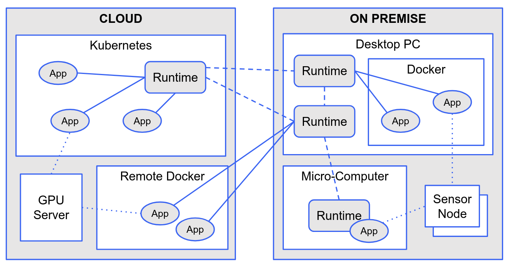

# Implementation

This document is intended to provide a high-level overview of the reference implementation, in particular the *Runtime Platform* and the *Agent Container*. For more detailed information, please refer to the [OPACA Paper](https://doi.org/10.1109/ACCESS.2024.3353613) and the documentation within the implementation's source code, as well as the additional documentation on specific aspects in this directory.

A multi-agent system in the OPACA approach consists of two types of components: **Runtime Platforms (RP)** and **Agent Containers (AC)**.

The following figure illustrates how the RP and AC can be deployed and connected with each others. The runtime platform can run natively on a computer, in Docker or in Kubernetes. Agent containers typically run in Kubernetes or a (remote) Docker engine, but may also be deployed natively and bundled with a Runtime platform for resource-limited devices (work in progress). Multiple RPs (and their containers) can be connected to each other. Very limited devices such as microcontroller sensor nodes may be connected via the REST API.

Please refer to the documentation on the different [environments](environments.md) the Runtime Platform and Agent Containers can run in.

## Runtime Platform

The Runtime Platform is used to manage one or more Agent Containers, deploying those in Docker or Kubernetes. They connect different Agent Containers while also providing basic services such as yellow pages, authentication, etc.

### Overview

The Runtime Platform provides REST routes for managing (adding, listing, updating, removing) both, containers running in the container runtime (Docker or Kubernetes) associated with that particular Runtime Platform, and connections to other Runtime Platforms (and thus their containers) running on a different host.

* The `info` route is used to get information on the Runtime Platform, its currently deployed containers and connections to other platforms.
* The different `containers` routes are used to get information on one specific or all agent containers currently running on this platform as well as to deploy new containers or update or remove existing ones.
* Likewise, the `connections` routes are used to get a list of connected platforms, to establish or remove connections to other platform or update the information on those platforms.

In addition to those, the Runtime Platform provides all the routes of the Agent Container (see below), forwarding the calls to the Agent Container providing the respective agent or action (if it exists), both within the platform’s own containers and within connected platforms.

When an Agent Container is started, the Runtime Platform will pass certain environment variables into the container, such as the container’s own ID, information needed for communicating with the platform, as well as application-specific parameters for, e.g., interfacing with external resources, defined in the Agent Container’s description.

### Implementation Details

The runtime platform is implemented in Java using [Spring Boot](https://spring.io/projects/spring-boot). The main entry point is the `Application` class. Environment variables are captured in the `application.properties` file and accessed via `PlatformConfig`.

The REST routes corresponding to the OPACA API are defined in the `PlatformRestController` and preprocessed in the `EventsFilter` for e.g. creating "events" for certain API calls. The actual implementation logic is in the `PlatformImpl` class. The main responsibility of the Runtime Platform is twofold: First, it has to manage (start and stop) Agent Containers and connected Runtime Platforms; second, it has to forward incoming requests to the appropriate container or connected platform.

#### Container Management

The logic for managing agent containers is split between a generic part in the `PlatformImpl` and different backend-specific implementations in the `containerclient` package, e.g. for Docker or Kubernetes. The general procedure is as follows:

* the platform generates an access token for the container
* the container client will pull the image and start the container
  * any ports the container should expose are mapped to free ports on the host machine and exposed
  * the container's own ID, the runtime platform's base URL and the access token are passed to the container as environment variables
* the platform creates a temporary user for the container

When the Agent Container is removed, the backing container is stopped and the respective token and user removed again.

#### Connections Management

When connecting to another Runtime Platform, the platform will get that platform's info (the containers running there) and add the platform to the list of connected platforms. Note that if the platform requires [authentication](auth.md), the connection will be in one direction only, whereas if no authentication is required, the other platform will be asked to connect back to the calling platform. Connected platforms are notified when containers are added or removed. Also see [here](protocols.md) for details.

#### Message Forwarding

For the routes of the Agent Container API, i.e. `send`, `broadcast` and `invoke`, the Runtime Platform will look up the deployed Agent Container (or connected Runtime Platform) that provides the requested agent or action and forward the call to those. If there are multiple "candidates" that provide the requested action and/or an agent with the given name, then each of those will be asked in turn, starting with locally deployed containers and then connected platforms, until one of the calls is successful. Only a `broadcast` will always be forwarded to all deployed containers and platforms.

Note that in all cases, connected runtime platforms will _only_ be considered if the query-parameter `forward` is `true`. If the request should only be sent to a specific container, that container's `containerId` can be provided.

#### Other Functions

Besides that, the runtime platform offers additional routes and functionality for [basic authentication](auth.md), [session handling](session.md), [user management](user-management.md) and [input validation](validation.md), which are covered in separate documents.

## Agent Container

Agent Containers are containerized applications that implement the OPACA Agent Container API. They provide REST routes for finding out about the agents within the container, and to interact with them by means of sending asynchronous messages (unicast and broadcast) and invoking synchronous actions.

Note that all interaction with Agent Containers -- both originating from a user of the system or a different container -- will be routed via the container's parent Runtime Platform: A user would typically not interact with an AC directly, but invoke the services at the Runtime Platform, which then delegates to the appropriate AC. Likewise, an AC calling an action at another AC will call that action at its own parent platform, which then relays it to that other agent container (possibly routing it via a connected platform first). Please refer to the different [Protocols](protocols.md) for details.

### Overview

The Agent Container provides REST routes that allow the outside world to find out about the agents running inside the container, and to interact with those agents by means of sending asynchronous messages (unicast and broadcast) and invoking synchronous actions.

* The `agents` route is used to get information on one or all agents and their actions running in the component.
* The `send` and `broadcast` routes are used to send an asynchronous message to a specific agent, or to all agents subscribed to the given channel or topic.
* The `invoke` route is used to invoke an action or service provided by either any or the given agent and get the result (synchronously). Expected parameter and output types, as well as an optional description, are given in the action object returned by the above `agents` route.

### Implementation Details

The reference implementation of the Agent Container is done in Kotlin in [JIAC VI](jiac-vi.md), but any other language or framework can be used, too, as long as the OPACA API is implemented. Depending on the purpose of the container, it does not even have to be actual "agents" but just a simple web server.

Each Agent Container includes one `ContainerAgent`, which will run a very simple web server providing the different OPACA API routes, and act as a bridge between that web server and the actual "JIAC VI world". It keeps track of the "actual" agents running in the container and their actions and will forward any incoming requests to the appropriate agent. The Container Agent itself does not appear in the list of `agents` returned by the respective API route, but only agents that register with the Container Agent.

Those agents should extend the `AbstractContainerizedAgent` which will handle much of the logic for registering and deregistering with the Container Agent (and thus the parent Runtime Platform), and also provides useful helper methods for defining and reacting to OPACA Actions and Streams, and for sending "outbound" `send`, `broadcast` and `invoke` requests to their parent Runtime Platform and thus other Agent Containers.

Besides the Container Agent and registered Containerized Agents, the agent system in the container can also include any number of "internal" agents, that do not register with the Container Agent and thus do not show up in the container's `agents` list. The communication between those and the Containerized Agents should happen through the regular `tell`, `publish` and `invoke ask` behaviors of JIAC VI. Please refer to the last part of the [documentation on JIAC VI](jiac-vi.md) for how those relate to the respective OPACA functions.

### Examples

For more on how to implement agent containers and their containerized agents using the OPACA reference implementation, please refer to the examples:

* The `sample-container` example does not do anything meaningful, but it uses all the features provided by the API, including e.g. extra-ports. It's main purpose is to be used in the unit tests for the runtime platform, but it can also be used as a reference for how to implement those features.
* The `ping-pong` example focuses on the different means of interaction between containers using all of `send`, `broadcast` and `invoke` in a toy-example. The Ping and Pong agents can run in the same container, or in different containers, thus also serving as a test for inter-container and inter-platform communication.
* The `testing` example includes some cases that may have caused problems in the past, e.g. causing lost messages and similar, but it also shows how an agent container can quickly be tested without actually having to deploy it to a Runtime Platform.
