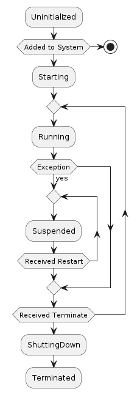

# JIAC VI Basic Documentation

The reference implementation of the OPACA Agent Container is written in JIAC VI, developed by DAI-Labor, and in particular by Christian Rakow. This document provides a broad overview of the framework and its most relevant features for developing OPACA Agent Containers. The documentation is separated into multiple sections. First an introduction to *JIAC Intelligent Agent Componentware* (JIAC VI) and its concepts.


## Overview and Setup

Nearly all parts of `JIAC VI` are written in [Kotlin](https://kotlinlang.org/), which is also the preferred language to develop new agents. Kotlin allows programming in a concise and safe manner and its language features are beneficial to define agent-first DSLs. It is also fully compatible to Java, so you can use any Java library or even mix Java code into your JIAC VI project. The agents, too, can be written in pure Java instead of Kotlin, but the result code would be much more verbose and harder to read. In this documentation, we will thus only use Kotlin.

To get started simply include the maven dependency and dive deeper into the documentation and available examples.

* Maven
	```xml
	<dependency>
		<groupId>de.dailab.incubator</groupId>
		<artifactId>jiacvi-core</artifactId>
		<version>${version}</version>
	</dependency>
	```

* Gradle
	```
	compile "de.dailab.incubator:jiacvi-core:$version"
	```

The core and all other described modules are published in our maven repository <http://repositories.dai-labor.de/extern/content/repositories/dai-open/>

If you are using a different/newer Kotlin version than the one that comes with JIAC VI you may also want to include that as an explicit dependency.

`JIAC VI` is designed with an agent core that is as minimal as possible and can be easily integrated with existing technologies as needed. The core documentation covers the following topics:

* Agent System: General architecture and how to run a system.
* Agent: Definition of an agent and its inner workings.
* Behaviours: Documentation of core behaviours to program agents.
* Messaging: How agents communicate and integration into external systems.
* Services: Define services that can be consumed by other applications or integrate existing ones.


## Agent System

The `AgentSystem` is the entity that contains all its agents and management functionality. Agents exists locally only within one `AgentSystem`, but can communicate to agents from other systems by means of messaging.

The following image shows the overall system architecture.


### Initialization

Generally there should be exactly one `AgentSystem` per process. An `AgentSystem` can be defined and started with a DSL as in the following example:

```kotlin
import de.dailab.jiacvi.dsl.agentSystem // More imports have been omitted

fun main(args: Array<String>) {

    val system = agentSystem("Test", "test.conf") {

        enable(LocalBroker) // <1>

        agents {
            add(TestAgent()) // <2>
        }

        modules {
            bind<SomeSkill>() with instance(SomeSkill()) // <3>
        }

        serialization {
            bind<Any>(MessageSerializer.name) // <4>
        }

    }.start()
}
```

* 1: Enabling of an `AgentModule`
* 2: Adding agent instances to the system
* 3: Example of dependency injection
* 4: Defines a binding for any data type to use the MessageSerializer

In addition to the definition via the DSL, the system takes an optional reference to a config file, which can be used to configure the dispatcher, scheduler, etc.


### Modules

Modules are classes that inherit from the `AgentModule` class and provide their own agents, corresponding functionality and also bindings for the dependency injection. All modules can be added to the system via `enable(...)`. Some offer additional configuration, which should be looked up on the corresponding documentation for the module.


### Dependency Injection

Internally `JIAC VI` uses [Kodein](http://kodein.org/Kodein-DI/index.html?latest/core) for dependency injection. All bindings declared within the `module` block will be available to all agents. Please refer to the Kodein documentation for information about different binding types.


### Serialization

Messages that go through a message broker typically have to be serialized, i.e. converted to a format that can be sent over the wire and understood by different system. By default, `JIAC VI` will use its own wire-format.


## Agent

An `Agent` in `JIAC VI` is the entity that implements the desired behaviours e.g. by reacting on events, acting periodically or according to a certain protocol.

Agents encapsulate their own state and should entirely communicate via message passing with other agents. The most basic agent only consists of its `Mailbox` and implemented logic. Using this lightweight approach systems with multiple million agents are possible even on commodity hardware.


### Lifecycle

Agents follow a specific lifecycle starting from the initialization and adding to the system up to the moment when they are terminated:



While an agent is in the state `Running` it will receive and process incoming messages from its mailbox. If an unhandled exception occurs in one of the behaviours, the agent will be suspended and stops processing any more messages. The failure needs to be handled by its parent. How this is done is described in the Supervision section.

To define an agent, it has to inherit from the class `Agent`. This class provides abstract methods that can be overwritten to react on lifecycle changes.

```kotlin
import de.dailab.jiacvi.Agent // More imports have been omitted
class MyAgent : Agent() {

    override fun preStart() {
    }

    override fun postStop() {
    }

    override fun preRestart(cause: Throwable) {
    }

    override fun postChildFailure(f: Failed) { // <1>
    }

    override fun behaviour() = { 
		// ...  <2> 
    }
}

fun main() {
    val system = agentSystem("Test") {}
    val ref = system.spawnAgent(MyAgent()) // <3>
}
```

* 1: Called when a child has failed, after the supervision strategy was executed.
* 2: Most of the agent logic and inner workings are defined by overriding the default empty behaviour.
* 3: Spawns the agent on the system and returns its reference

The application logic is defined by implementing the agent's behaviour. The `JIAC VI` core contains already some basic reactive and communication behaviours, which are described in the Behaviours section.

WARNING: Never block execution within an agent! Agents should follow the paradigm of [Reactive Programming](https://www.reactivemanifesto.org).


### Agent Hierarchy

Agents on an `AgentSystem` are organized in a tree-like hierarchy. The goal with such structure is to achieve fault tolerance and split tasks by using child agents. Each agent has exactly one parent, that will execute a failure recovery strategy in case some exception is thrown during processing. If no parent is defined explicitly, the `RootGuardian` will be assigned as parent, which is at the very top of the hierarchy.,


The hierarchy also defines the address of an agent, which follows an URI like format. Parent and children are separated by `/`, `@ID` can be used to address specific agents by their identifier. The address is relevant in order to communicate and send messages to specific agents.

NOTE: The id must be unique across all children of a parent.

NOTE: The name and path of the agent is derived by its class name if not given otherwise.

If an agent is terminated, it will terminate all of its children recursively and clean up the references.


### Communication

Agents should never expose their internal state or references of themselves to any other agent. Instead, all interaction is done via message passing. First the `AgentRef` of the desired agent needs to be acquired.

```kotlin
val system = agentSystem("test") { 
	// ... 
}.start()

val ref = system.resolve("MyAgent") // <1>

ref tell "Hello" // <2>
```

* 1: Retrieves reference to "MyAgent" from the root of the hierarchy.
* 2: Sends a plain string as message, on which the agent can react.

Using `tell` on the `AgentRef` will dispatch any kind of message to the agent's inbox.
Some core behaviours, which can react on simple messages are described in the section about behaviours.


### Supervision

In order to achieve fault-tolerance and resilience `JIAC VI` makes use of the concept of supervision. If an exception occurs during the processing in an agent it will be suspended and the parent has to execute one of the following directives.

```kotlin
enum class Directive {
    Resume,
    Restart,
    Stop,
    Escalate
}
```

* Resume: Resume message processing for the failed agent.
* Restart: Restart the agent.
* Stop: Terminates the agent.
* Escalate: Escalate to the supervisor, which will rethrow the same exception.

The supervision consists not only of the directive, but also how it is applied. Every agent including the `RootGuardian` will use the default supervisor strategy if not specified otherwise:

```kotlin
bind<SupervisorStrategy>() with provider {
     BackoffStrategy(kodein, SupervisorStrategy.defaultDecider, 3, ofMillis(200), ofMillis(1_000), 0.1)
 }
```

By default, an agent will be restarted 3 times with a waiting time in between that increases exponentially. The restart counter is reset if the agent was running without any failure for a minute. If it reaches the restart limit the exception will be escalated to the parent. If the `RootGuardian` has to escalate an exception the `AgentSystem` will be terminated, as there is no chance for recovery at this point.


## Behaviours

Generally each agent is equipped with a set of one or more behaviours that are defined by overriding the `behaviour` method of an agent. `JIAC VI` provides an implementation for a reactive behaviour that can be defined conveniently via an DSL using the `act` method. The parameter to `act` is a runnable `{ ... }` that can be used to register different callbacks for different events using the `on`, `listen`, `every` and `respond` methods described below, each of  which take additional (type-) parameters as well as a runnable `{ ... }` that will be executed when that event is triggered.

The following is an overview of the different standard callbacks and how they are triggered:

| Callback        | Trigger                                                    |
| --------------- | ---------------------------------------------------------- |
| `on<T>`         | `tell` message of type `T`                                 |
| `on<T>(c)`      | `tell` message of type `T` matching condition `c`          |
| `listen<T>(s)`  | `publish` message of type `T` to channel `s`               |
| `every(t)`      | time `t` passed since startup or last execution            |
| `respond<T, V>` | `invoke ask` message of type `T` expecting result type `V` |


### Reactive

The reactive behaviour allows to `act` on specific message types. Here, the `on` behavior is used for directed messages sent with `ref tell <message>`, whereas the `listen` behavior is used for broadcast messages sent with `broker.publish(<channel>, <message>)`

```kotlin
override fun behaviour() = act {
    on<String>({ it == "hello" }) {  //<1>
        log.info("Got hello message")
    }

    on<AgentRef<Any>> {
        it tell "Hello" // <2>
    }

    listen<Message>("channel") {
        log.info("Got $message sent to 'channel'")
    }
}
```
* 1: Reacts on strings that are equal to "hello"
* 2: `it` is first argument, i.e. the message, implicitly defined by Kotlin.


### Reoccurring

By using the keyword `every` the specified function will be registered at the scheduler to execute periodically, e.g. every few seconds, or hours. Note that the first execution of these callbacks will be after the first interval has passed, not directly after the agent started.

```kotlin
override fun behaviour() = act {
    every(Duration.ofMillis(100)) { // <1>
        log.info("Executing...")
    }

}
```
* 1: Will execute the function every 100ms


### Ask protocol

Often we not only want to send a message but also receive a reply from the receiver. This use-case requires that the sender and receiver use and understand the same protocol. A simple ask protocol is already defined in the `JIAC VI` core and implemented in the behaviour.

```kotlin
class MyAgent : Agent() {
    override fun behaviour() = act {
        respond<Int, String> { // <1>
            return@respond it.toString()
        }
    }
}

fun main() {
    val ref = system.spawnAgent(MyAgent())
    ref invoke ask<String>(1) { // <2>
        assertEquals("1", it)
    }.error {
        // <3>
    }.timeout(Duration.ofSeconds(5)) // <4>
}
```

* 1: The agent will respond on all Integers messages with a String
* 2: Asks for a String in as response to the Int message
* 3: optional error callback, also invoked in case of a timeout
* 4: optional timeout (default is 30 seconds)

NOTE: The ask protocol is non-blocking and the result callback is executed as soon as the result is received.


### Extending behaviors

To extend the behavior defined in the agent's super class with additional event handlers and callbacks, the `and` method can be used, e.g.

```kotlin
override fun behaviour() = super.behaviour().and(act {
    ...
})
```


### Custom behaviour

New behaviour types can be defined by inheriting from the class `Behaviour`. In order to implement a custom behaviour the method `onReceive`, which will be called on every received message, can be overwritten. Additionally, behaviours can also act on start and stop events of the agent for initialization and cleanup purposes.

```kotlin
import de.dailab.jiacvi.behaviour.Behaviour

class CustomBehaviour : Behaviour() {

    override fun preStart() {}

    override fun postStop() {}

    override fun onReceive(env: Envelope): Boolean {} // <1>

}
```

* 1: If the method returns true, other behaviour of the agent will *not* be executed.


## Messaging

A `BrokerAgent` is a special kind of agent that translates messages to be send to external systems.

Via the broker agents it is possible to receive any arbitrary byte message. Yet in order to understand a message a dedicated format is needed that defines how meta information like headers, receiver or serialization is encoded.

NOTE: The core provides no implementation to communicate externally. Please refer to the modules to choose a suitable
technology stack, e.g. mqtt, http, etc.
