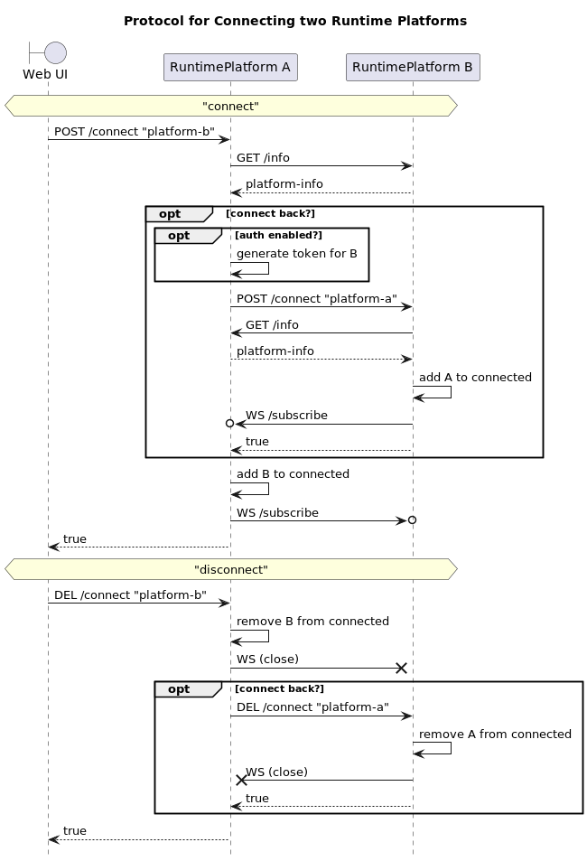

# Protocols

## Message Flows in Reference Implementation

### Runtime Platform to Agent Container

* **message**: HTTP Request to CA (in HTTP handler thread), send message via `agent_ref tell`
* **broadcast**: HTTP Request to CA (in HTTP handler thread), send message via `broker.publish`
* **invoke**: HTTP Request to CA (in HTTP handler thread), send `Invoke` to agent via `ask invoke` protocol, wait for response (in CA thread), reply in HTTP response

### Agent Container to Runtime Platform

* **message**: agent sends HTTP Request to RP via helper method in super class
* **broadcast**: agent sends HTTP Request to RP via helper method in super class
* **invoke**: agent sends HTTP Request to RP via helper method in super class, waits for response in its own thread

### Within Agent Container

* **message**: using regular JIAC-VI `agent_ref tell`
* **broadcast**: using regular JIAC-VI `broker publish`
* **invoke**: using regular JIAC-VI `ask invoke`, either with OPACA `Invoke` object or any other payload

### Runtime Platform to Runtime Platform 

* **send**, **broadcast** and **invoke** have optional query parameter `forward` with default value `true`
* look up connected RP that have the target agent or action
* **send** and **broadcast**: forward message to all valid platforms
* **invoke**: forward invoke to first valid connected platform
* `forward` parameter gets automatically set to `false` in the request to the connected platform to prevent endless forwarding

## Protocol for connecting two Runtime Platforms

* platform A receives request to connect to platform B
* platform A fetches `/info` from platform B
* if requested to connect back, platform A sends request to connect to itself to platform B
  * note: if platform A requires auth, this request to platform B will include a newly generated access token for platform A!
* platform A opens a websocket connection to `/subscribe` on `/containers` events on platform B
* when disconnecting, the websocket is closed, and platform B may also be asked to disconnect from platform A

## Protocol for notifying about updated Containers or connected Platforms

* container/platform calls `/containers/notify` or `/connections/notify` with own ID/URL respectively
* the idea behind "notify, then pull info" instead of "push info" is to make sure that the info does actually come from the container/platform in question and not someone else
* receiving platform calls `/info` for that container/platform, stores updated information
* return `true` if update successful, `false` if not reachable (see below) and 404 if unknown/not in list
* if container/platform are not reachable, their information is removed from the platform
* can be called if container's agents/actions change, if container is about to die, or at any time by the user
* update in containers (via add/remove or update) automatically triggers notification of connected platforms

