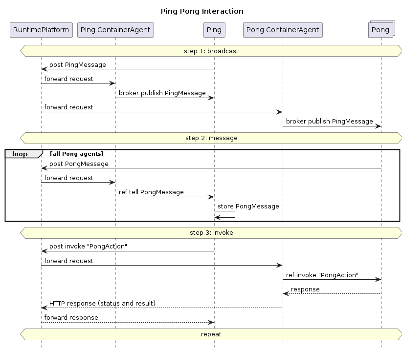

# Ping Pong Example

Simple distributed example for testing communication between different AgentContainer instances, between
AgentContainer and RuntimePlatform and back, and between different RuntimePlatforms.

The general flow of messages is as follows:

* in regular intervals, Ping agent sends a Broadcast message to all Pong agents
* Pong agents reply with an offer (just a random number) in a Directed message
* Ping agent evaluates all offers and sends an Invoke message to the Pong agent with the best offer

With this, all three messaging mechanisms -- directed, broadcast, and invoke -- can be tested in different scenarios:

* Ping and Pong agent(s) in the same AgentContainer
* Ping and Pong in different AgentContainers under the same RuntimePlatform
* Ping and Pong in different AgentContainers under different RuntimePlatform

## Starting process for distributed Ping Pong:

* run `mvn install`
* start runtime platform
* go to `pingpong` directory
* run `docker build -f Dockerfile_Ping -t ping-container-image .` to create Ping agent container
* run `curl -X 'POST' 'http://localhost:8000/containers' -H 'Content-Type: application/json' -d '{"imageName": "ping-container-image"}'` to deploy ping agent container on runtime platform
* do the same with `pong` instead of `ping` to start the container with the Pong agent
* check container names with `docker ps`, then see logs with `docker logs -f <container_namw>`

You may also run both the ping and pong agents in the same container; for this, adapt the `Main.kt` accordingly to
create both a ping agent and (one or more) pong agents.

## Interaction

